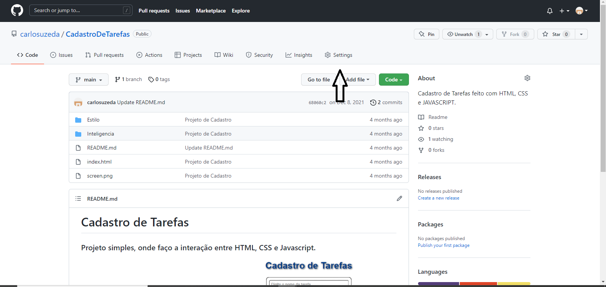
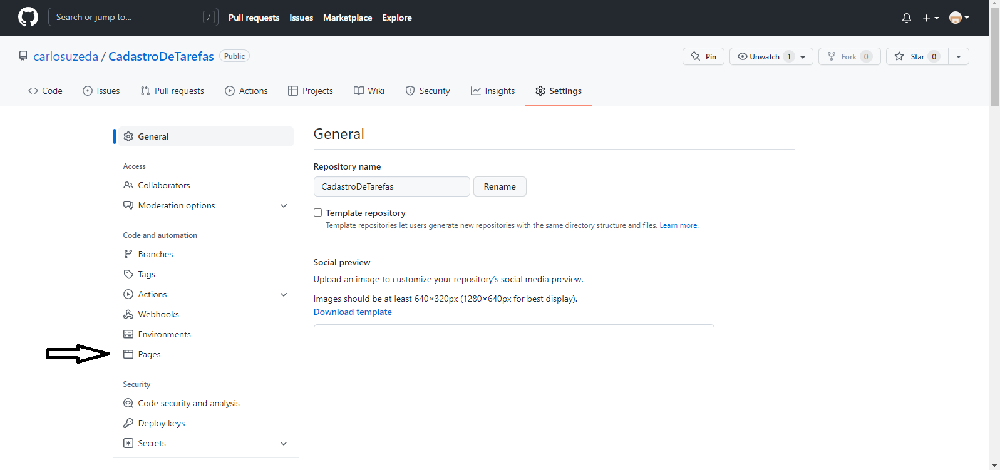
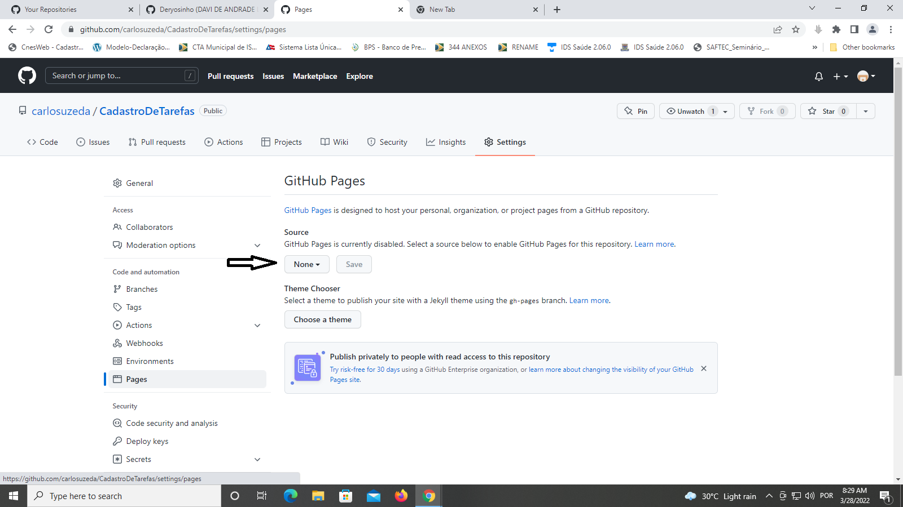
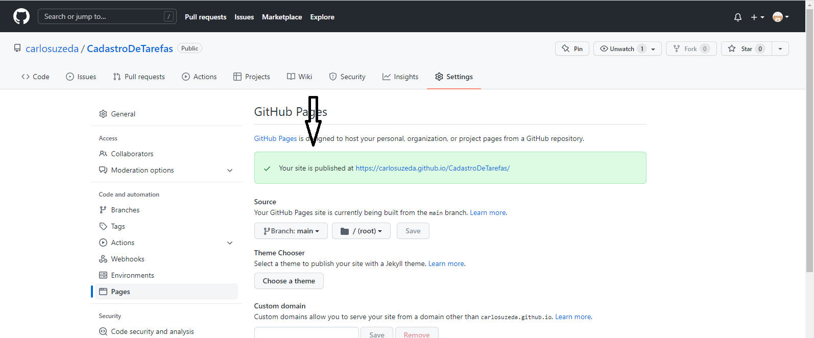

# GitHub Pages

## Gostaria de ter o seu projeto online?

## Mas o que é GitHub Pages?

Ele consiste em um serviço de hospedagem de site estático, ou seja, um projeto que utiliza arquivos HTML, CSS e JavaScript diretamente de um repositório no GitHub. Essa hospedagem ocorre pela execução dos arquivos procedida pela publicação em um site.

#

## Vamos lá?

### Vamos solicitar que o GitHub disponibilize um link do GitHub Pages para essa nossa aplicação estática. Para isso, você precisa ir até a aba "settings" do seu repositório.

### Uma vez que você tenha acessado esta aba, você deve clicar no menu "pages", disponível na barra lateral.

### O último passo consiste apenas em ir até à seção "source", selecionar a branch **main** no dropdown e clicar no botão "save". Observe esses passos na imagem abaixo:

### Após isso, aguarde alguns segundos até aparecer uma mensagem com background verde, afirmando que seu site foi publicado e, então, clique no link disponibilizado.

#

## Demonstração

https://carlosuzeda.github.io/CadastroDeTarefas/

## Concluindo 

### Com isso, notamos o quão fácil é criar uma página de apresentação para nossos repositórios de forma totalmente gratuita. 

## Autor

[@carlosuzeda](https://www.github.com/carlosuzeda)
